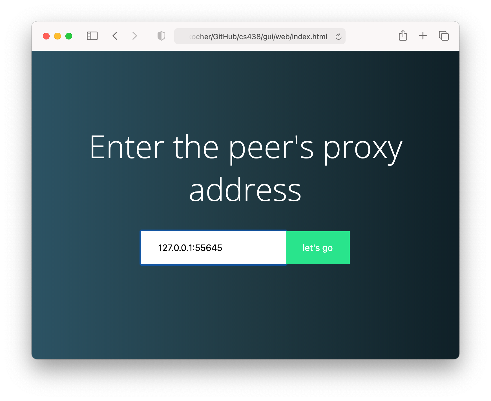
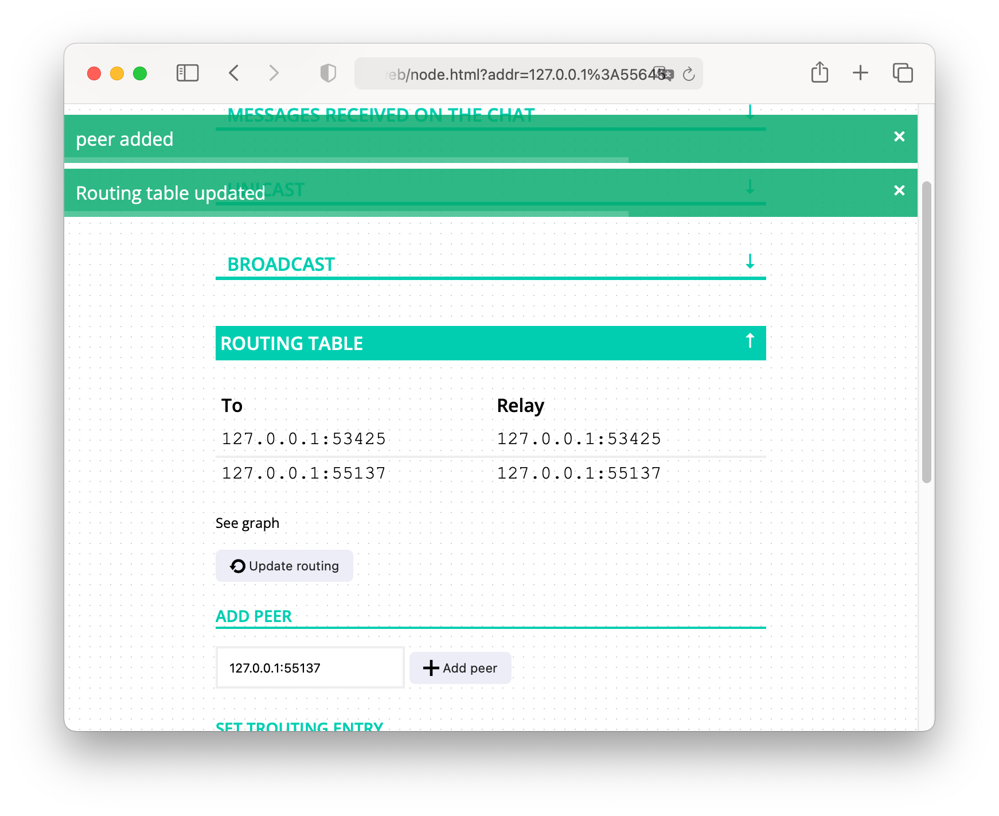
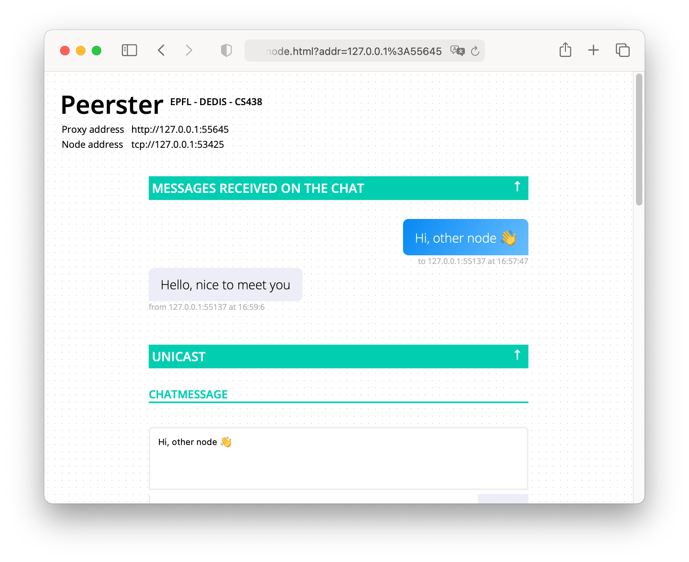

# Onion Peer

Project for the "Decentralized System Engineering" course.
Built on top of the homework solutions from Louis Chapuis for the CS-438 course (Homework 0 and 1).

## AI usage

AI was used to refactor a lot of the code, to add comments, and for debugging.
## Run the tests

To run all the `Tor-related` tests (unit and integration), run: 

```sh
make test_tor
```

You can also run them individually:
 
- unit tests: 
```sh
make test_unit_tor
```

- integration tests: 
```sh 
make test_int_tor
```

- performance tests: 
```sh
make test_perf_tor
```

You can also just run `make` to run all the tests, but it will also run the tests for homeworks 0 and 1.
### Reproducing the results

If you wish to reproduce the results of the performance tests, you can run: 

```sh
make FIXME
```

## Code Coverage

To compute code coverage for our implementation:

```sh
go test ./peer/tests/...   -coverpkg=./peer/...   -coverprofile=peer.coverage.out
```

To visualize the coverage in HTML (for example using Firefox):

```sh
go tool cover -html=peer.coverage.out -o peer_coverage.html
firefox peer_coverage.html
```

## Quick setup (CHANGEME TO CLI)

Install go = 1.23.

Run a node:

```sh
cd gui
go run gui.go start
```

Then open the web GUI page `gui/web/index.html` and enter the peer's proxy
address provided by the peer's log: `proxy server is ready to handle requests at
'127.0.0.1:xxxx'`. You can run as many peers as wanted and connect them together
using the "routing table" > "add peer" section in the WEB GUI.

## Screenshots

1. Connect to a peer's proxy



2. Add a peer



3. Exchange chat messages


